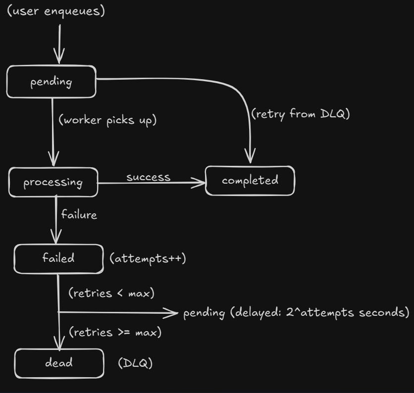

# QueueCTL - Background Job Queue System

A production-grade, cross-platform CLI-based job queue system with worker processes, retry mechanism with exponential backoff, and Dead Letter Queue (DLQ) support.

## ✨ Key Features

- **Windows-Safe**: Uses multiprocessing spawn mode compatible with Windows
- **Separate Modules**: Clean separation between storage, worker, and CLI
- **SQLite WAL Mode**: Concurrent readers/writers support
- **Fresh Connections**: Each operation uses a new DB connection (multiprocessing-safe)
- **Exponential Backoff**: Configurable retry strategy
- **Dead Letter Queue**: Permanent failure handling
- **Daemon Mode**: Background worker management (Linux/Mac)

---

## 🎥 Demo Video

[▶️ Watch QueueCTL Demo Video](https://drive.google.com/file/d/1nbhAyTk6IoGLssGFYgFWCxaxMmbi2lH1/view?usp=sharing)

Click the link above to see QueueCTL in action!

---

## 📋 Table of Contents

- [Demo Video](#-demo-video)
- [Requirements](#-requirements)
- [Installation](#-installation)
- [Essential Commands](#-essential-commands)
- [File Structure](#-file-structure)
- [Job Lifecycle](#-job-lifecycle)
- [Configuration](#-configuration)
- [Assumptions & Trade-offs](#-assumptions--trade-offs)
- [Testing](#-testing)
- [Performance Characteristics](#-performance-characteristics)
- [License](#-license)
- [Contributing](#-contributing)
- [Support](#-support)

---

## 🔧 Requirements

- Python 3.8+
- No external dependencies (uses only Python standard library)
- Operating Systems: Windows, Linux, macOS

---

## 📦 Installation

### Step 1: Clone or Download

```bash
mkdir queuectl
cd queuectl

# Copy these files:
# queuectl.py
# storage.py
# worker.py
# ./tests/run_tests.sh (optional)
```

### Step 2: Make Scripts Executable (Linux/Mac)

```bash
chmod +x queuectl.py
chmod +x test.sh
```

### Step 3: Verify Installation

```bash
python3 queuectl.py --help
```

You should see the help menu with all available commands.

---

## 🎮 Essential Commands

### 1. Enqueue Some Jobs

```bash
# Enqueue a simple job
python queuectl.py enqueue "{\"id\":\"job1\",\"command\":\"echo This is task1\"}"

# Enqueue a failing job (for testing)
python queuectl.py enqueue "{\"id\":\"job_fail\",\"command\":\"not_a_real_command\"}"
```

### 2. Start Workers

```bash
# Start a single worker in foreground
python3 queuectl.py worker start

# Stop foreground workers
# Press Ctrl+C in the terminal

# On Windows, use foreground mode in separate terminals
python3 queuectl.py worker start --count 3
```

### 3. Monitor Status

```bash
# View system status
python3 queuectl.py status

# List all jobs
python3 queuectl.py list

# List jobs by state
python3 queuectl.py list --state pending
python3 queuectl.py list --state completed
python3 queuectl.py list --state failed
python3 queuectl.py list --state dead
```

### 4. Manage Dead Letter Queue

```bash
# View jobs in DLQ
python3 queuectl.py dlq list

# Retry a failed job
python queuectl.py dlq retry job_fail
```

### 5. Configure System

```bash
# View all configuration
python3 queuectl.py config get

# Set max retries
python3 queuectl.py config set max_retries 5

# Set backoff base (exponential backoff multiplier)
python3 queuectl.py config set backoff_base 3
```

### 6. Direct Database Access

```bash
# SQLite database
sqlite3 queuectl.db

# View all tables
.tables

# View all jobs
SELECT id, command, state, attempts, last_error FROM jobs;

# Filter by state (e.g., DLQ)
SELECT * FROM jobs WHERE state='dead';

# Delete all jobs (reset everything)
DELETE FROM jobs;

# Exit SQLite
.exit
```

---

## 📁 File Structure

```
queuectl/
├── queuectl.py          # Main CLI interface
├── storage.py           # SQLite database operations
├── worker.py            # Worker process logic
├── ./tests/run_tests.sh # Integration test script
├── queuectl.db          # SQLite database (created at runtime)
└── config.json          # Configuration file
```

### Module Responsibilities

#### 1. `queuectl.py` (CLI Layer)
- Command-line argument parsing
- User interaction
- Delegates to storage and worker modules

#### 2. `storage.py` (Data Layer)
- SQLite database operations
- Job CRUD operations
- State management
- Thread-safe with fresh connections

#### 3. `worker.py` (Processing Layer)
- Job polling and execution
- Retry logic with exponential backoff
- Multi-process worker management
- Graceful shutdown handling

---

## 🔄 Job Lifecycle



### State Descriptions

| State | Description |
|-------|-------------|
| `pending` | Job waiting to be picked up by a worker |
| `processing` | Job currently being executed by a worker |
| `completed` | Job successfully finished (exit code 0) |
| `failed` | Job failed but will be retried (attempts < max_retries) |
| `dead` | Job permanently failed (attempts >= max_retries), moved to DLQ |

### Retry Mechanism

**Exponential Backoff Formula:**
```
delay_seconds = backoff_base ^ attempts
```

**Example (with backoff_base=2):**
- Attempt 1 fails → retry after 2^1 = 2 seconds
- Attempt 2 fails → retry after 2^2 = 4 seconds
- Attempt 3 fails → retry after 2^3 = 8 seconds
- Attempt 4 fails → moved to DLQ (if max_retries=3)

> **Note:** Backoff is capped at 5 seconds to prevent excessive delays.

---

## ⚙️ Configuration

### Configuration File

**Location:** `config.json` (in current working directory)

**Default Settings:**
```json
{
  "max_retries": 3,
  "backoff_base": 2
}
```

### Configuration Options

| Key | Type | Default | Description |
|-----|------|---------|-------------|
| `max_retries` | int | 3 | Maximum retry attempts before moving to DLQ |
| `backoff_base` | int/float | 2 | Base for exponential backoff calculation |

### Runtime Configuration

Configuration can be changed at runtime:

```bash
# Update max retries
python3 queuectl.py config set max_retries 5

# Update backoff base
python3 queuectl.py config set backoff_base 3

# Workers will pick up new config on next job fetch
```

---

## 🤔 Assumptions & Trade-offs

### Design Decisions

#### 1. SQLite Over Redis/RabbitMQ

**Decision:** Use SQLite for job storage

**✅ Advantages:**
- Zero configuration required
- ACID guarantees (data durability)
- Built-in with Python (no dependencies)
- Perfect for single-machine deployments
- Sufficient for moderate throughput (<1000 jobs/sec)

**⚠️ Trade-offs:**
- Limited to single-machine deployment
- No native pub/sub (workers poll database)
- Throughput ceiling at ~1000 writes/second
- Not suitable for distributed systems

**Rationale:** Most job queues run on a single machine. SQLite provides excellent reliability without operational overhead.

#### 2. Multiprocessing (Spawn Mode) Over Threading

**Decision:** Use multiprocessing with spawn mode for workers

**✅ Advantages:**
- True parallelism (no GIL limitations)
- Process isolation (one crash doesn't affect others)
- Windows-compatible (spawn mode works everywhere)
- Fresh connections per process (no shared state)

**⚠️ Trade-offs:**
- Higher memory overhead (~20MB per worker)
- Cannot share database connections between processes
- Slower startup time vs threads

**Rationale:** Cross-platform compatibility and process isolation outweigh memory overhead for background job processing.

#### 3. Fresh Database Connections Over Connection Pool

**Decision:** Each operation opens a new SQLite connection

**✅ Advantages:**
- Multiprocessing-safe (no shared file descriptors)
- Simple implementation (no lifecycle management)
- No connection state issues across processes

**⚠️ Trade-offs:**
- Connection overhead (~1ms per operation)
- More file descriptors used

**Rationale:** Multiprocessing spawn mode doesn't share file descriptors. Fresh connections ensure safety across process boundaries.

#### 4. Database Polling Over Event-Driven

**Decision:** Workers poll database every 1 second

**✅ Advantages:**
- Simple implementation
- Works with SQLite (no pub/sub needed)
- No additional infrastructure required

**⚠️ Trade-offs:**
- Latency up to 1 second before job pickup
- CPU cycles wasted on empty polls
- Not instant job processing

**Rationale:** For background job processing, 1-second latency is acceptable. Event-driven architecture would require Redis/RabbitMQ.

#### 5. Shell Commands Over Function Registry

**Decision:** Execute arbitrary shell commands via `subprocess.run(..., shell=True)`

**✅ Advantages:**
- Maximum flexibility (any command/script)
- Language-agnostic (not limited to Python)
- Simple interface (just provide command string)

**⚠️ Trade-offs:**
- Security risk (command injection potential)
- No type safety for parameters
- Requires command to be in PATH

**Rationale:** Flexibility for diverse use cases. Security addressed through documentation and recommended practices (command whitelisting).

#### 6. WAL Mode for SQLite

**Decision:** Enable Write-Ahead Logging (WAL) mode

**✅ Advantages:**
- Concurrent readers + 1 writer (no blocking)
- Better performance under concurrency
- Crash recovery support

**⚠️ Trade-offs:**
- Additional `-wal` and `-shm` files created
- Periodic checkpointing needed (automatic)

**Rationale:** Essential for multiple workers accessing database concurrently.

#### 7. Exponential Backoff Capped at 5 Seconds

**Decision:** Limit maximum retry delay to 5 seconds

```python
delay = min(pow(backoff_base, attempts), 5)
```

**✅ Advantages:**
- Prevents excessive delays for high retry counts
- Keeps workers responsive
- Reasonable for transient failures

**⚠️ Trade-offs:**
- For truly transient issues (>5s), jobs may hit DLQ prematurely

**Rationale:** Most transient failures (network blips, temporary locks) resolve within seconds. Longer delays indicate systemic issues better handled in DLQ.

#### 8. No Job Timeout by Default

**Decision:** Jobs run until completion or failure (no time limit)

**✅ Advantages:**
- Simple implementation
- Supports long-running jobs
- No premature termination

**⚠️ Trade-offs:**
- Hung jobs block workers indefinitely
- No protection against infinite loops

**Rationale:** Timeout requirements vary widely. Users can implement timeouts in their commands:

```bash
timeout 300 ./my_script.sh  # 5-minute timeout
```

### Simplifications Made

- **No Job Priority**: All jobs processed in FIFO order
  - *Simplification:* No priority queue implementation
  - *Future:* Can add priority column and `ORDER BY priority DESC`

- **No Scheduled Jobs**: No native support for `run_at` timestamps
  - *Simplification:* No scheduler component
  - *Future:* Can add `run_at` column and filter in query

- **No Job Dependencies**: No DAG or dependency tracking
  - *Simplification:* Each job independent
  - *Future:* Can add `job_dependencies` table

- **Foreground-Only Daemon on Windows**: Windows doesn't support `os.fork()`
  - *Simplification:* Graceful fallback to foreground mode
  - *Workaround:* Run in separate terminals or use Task Scheduler

- **No Metrics/Monitoring**: Basic status only
  - *Simplification:* No Prometheus/metrics endpoint
  - *Future:* Can add metrics collection and HTTP endpoint

- **No Web UI**: CLI-only interface
  - *Simplification:* Terminal-based interaction
  - *Future:* Flask/FastAPI dashboard can be added

### When QueueCTL is Right Choice

**✅ Perfect For:**
- Single-machine background job processing
- Moderate throughput (<1000 jobs/sec)
- Simple deployment (no external dependencies)
- Reliable persistence (ACID guarantees)
- Cross-platform support (Windows, Linux, Mac)

**❌ Not Recommended For:**
- Distributed multi-machine systems
- High-throughput (>10k jobs/sec)
- Real-time processing (<100ms latency)
- Complex job dependencies (DAGs)
- Jobs requiring shared in-memory state

---

## 🧪 Testing

### Prerequisites

- Python 3.8+ installed
- SQLite3 (bundled with Python, verify with `sqlite3 --version`)
- All three files present: `queuectl.py`, `storage.py`, `worker.py`

### Run Tests

```bash
./tests/run_tests.sh
```

### Test Coverage

1. Basic job completes successfully
2. Failed job retries with backoff and moves to DLQ
3. Multiple workers process jobs without overlap
4. Invalid commands fail gracefully
5. Job data survives restart

### Success Criteria

**✅ All tests pass when:**
- Test script exits with code 0
- All 5 test sections show ✅
- No error messages in output

---

## 📊 Performance Characteristics

### Throughput

- **Single Worker**: ~10-50 jobs/second (depending on job complexity)
- **Multiple Workers**: Scales linearly up to ~10 workers
- **Bottleneck**: SQLite write operations (~1000 writes/sec)

### Scalability Limits

**Current Design:**
- Single machine deployment
- Up to 50 concurrent workers
- Millions of jobs in queue

**Not Designed For:**
- Multi-machine distributed systems
- High-throughput (>10k jobs/sec)
- Long-running jobs (>1 hour)

---

## 📄 License

MIT License - Free to use and modify

---

## 🤝 Contributing

Contributions welcome! Please:

1. Fork the repository
2. Create a feature branch
3. Submit a pull request

---

## 📞 Support

For issues or questions:
- Create a GitHub issue
- Check the troubleshooting section
- Review the architecture document

---

**Author:** Ehtesham Ali Haidar  
**Date:** November 2025
